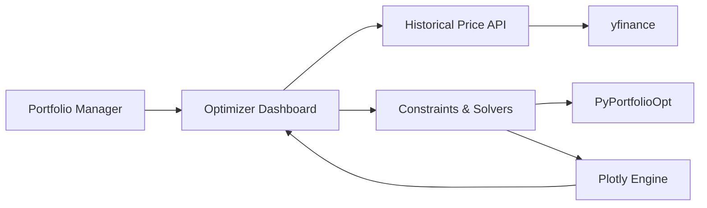

# Dynamic Portfolio Optimizer

## The Problem
Portfolio optimization often feels black-boxed, and hard-coded mathematical outputs don't give portfolio managers an intuitive feel for how specific constraints affect outcome. Modifying constraints like single-asset maximum weights in traditional quant pipelines is often slow and requires rerunning code.

## Success Looks Like
A sleek, interactive Streamlit dashboard where a user can enter 5 to 15 tickers. The app automatically fetches data, computes optimal weights based on the selected objective (Max Sharpe vs. Min Volatility), and instantly renders a dynamic Plotly Efficient Frontier chart. Adjusting the "Max Weight Constraint" slider updates the entire allocation and curve in real-time.

## How We'd Know We're Wrong
If the Streamlit app becomes too slow (taking more than 3-5 seconds to recalculate and render the Plotly chart when adjusting the weight slider), the tool fails its interactive dynamic requirement. Or, if the constraints break the PyPortfolioOpt solver routinely (resulting in unsolvable mathematical states continuously failing silently).

## Building On (Existing Foundations)
- **PyPortfolioOpt** — Used for all core mathematical optimization (covariance matrices, expected returns, min-volatility, and max Sharpe ratio computations).
- **yfinance** — Used for fetching reliable, timely historical price data using standard ticker symbols.

## The Unique Part
The primary unique value is the seamless real-time "What-if" analysis: an interactive constraint slider to cap maximum single-stock exposure, coupled with immediately recalculated optimization objectives (Max Sharpe / Min Vol) overlaid cleanly on an interactive Plotly Efficient Frontier.

## Tech Stack
- **UI:** Streamlit
- **Visualization:** Plotly
- **Data Iteration:** yfinance, pandas
- **Calculations:** PyPortfolioOpt, numpy

## System Context

