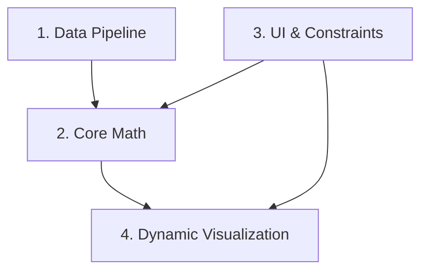

# Roadmap

Building on: PyPortfolioOpt and yfinance

## Sections

### [x] 1. Data Pipeline (yfinance)
Fetching, cleaning, and formatting the historical price data for the user-defined list of 5-15 tickers.

### [x] 2. Core Math (PyPortfolioOpt)
Calculating the covariance matrix, expected returns, and running the base Markowitz optimization.

### [x] 3. UI & Constraints (Streamlit)
Building the interface, specifically the input fields, the objective toggle (Max Sharpe/Min Vol), and the single-stock max weight slider.

### [x] 4. Dynamic Visualization (Plotly)
Generating the Efficient Frontier chart and wiring it to automatically recalculate and redraw when the UI constraints are adjusted.

## Dependencies

_Build order: Start with sections that have no incoming arrows._
